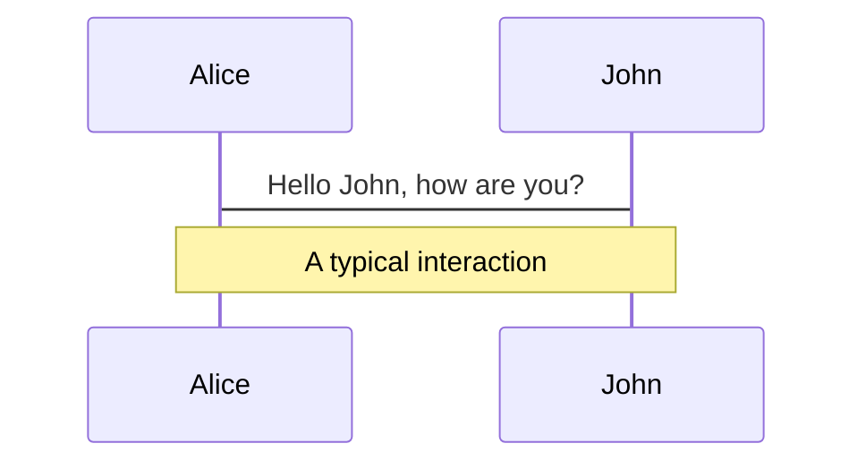
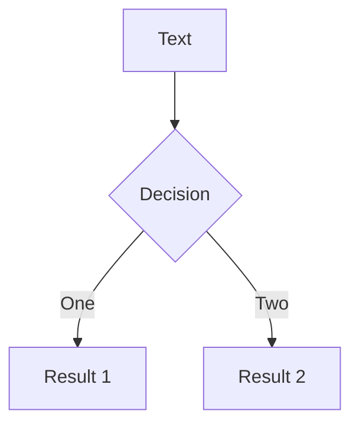
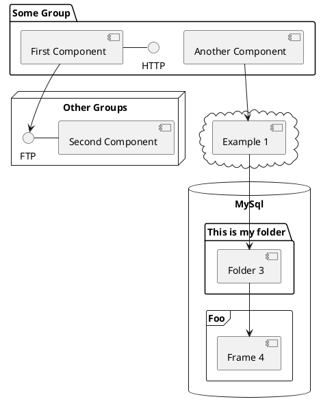

---
# try also 'default' to start simple
theme: seriph
# random image from a curated Unsplash collection by Anthony
# like them? see https://unsplash.com/collections/94734566/slidev
background: https://source.unsplash.com/collection/94734566/1920x1080
# apply any windi css classes to the current slide
class: "text-center"
# https://sli.dev/custom/highlighters.html
highlighter: shiki
# show line numbers in code blocks
lineNumbers: true
# some information about the slides, markdown enabled
info: |
  ## TypeScript 在 Vue 中的使用

  Learn more at [Sli.dev](https://sli.dev)
# persist drawings in exports and build
drawings:
  persist: false
# use UnoCSS
css: unocss
---

# TypeScript 分享

<vscode-icons-file-type-typescript-official/> <vscode-icons-file-type-vue/>TypeScript 及其在 Vue.js 中的使用

<vscode-icons-file-type-typescript-official class="fixed text-100px left-10 top-5"/>
<vscode-icons-file-type-vue class="fixed text-100px right-10 top-5"/>
<div class="text-gray-400">-- 朱晓东 2022/11/01</div>

<div class="pt-12">
  <span @click="$slidev.nav.next" class="px-2 py-1 rounded cursor-pointer" hover="bg-white bg-opacity-10">
    Press Space for next page <carbon:arrow-right class="inline"/>
  </span>
</div>

<style>
  h1{
    font-size:48px !important;
  }
</style>

---

# What is TypeScript?

TypeScript 是有类型的 JavaScript，同时它也是⼀⻔完全独⽴的编程语⾔。
它拥有强⼤的类型系统，可以完美的兼容 JavaScript，同时它可以帮助你弥补很多 JavaScript ⽋缺
的东西。

<div v-click="1">

- 是添加了类型系统的 JavaScript，适用于任何规模的项目。
- 是一门静态类型、弱类型的语言。
</div>

<div v-click="2">

<div v-click-hide="3">

```js
let foo = 1;
foo.split(" ");
// Uncaught TypeError: foo.split is not a function
// 运行时会报错（foo.split 不是一个函数），造成线上 bug
```

```ts
let foo = 1;
foo.split(" ");
// Property 'split' does not exist on type 'number'.
// 编译时会报错（数字没有 split 方法），无法通过编译
```

</div>

</div>

<div v-click="4">

<div v-click-hide="5" class="fixed top-55">

```ts
console.log(1 + "1");
// 打印出字符串 '11'
```

```python
print(1 + '1')
# 报错：TypeError: unsupported operand type(s) for +: 'int' and 'str'
```

</div>

</div>

<div v-click="6" class="fixed top-55">

- 是完全兼容 JavaScript 的，它不会修改 JavaScript 运行时的特性。
- 可以编译为 JavaScript，然后运行在浏览器、Node.js 等任何能运行 JavaScript 的环境中。
- 拥有很多编译选项，类型检查的严格程度由你决定。
- 可以和 JavaScript 共存，这意味着 JavaScript 项目能够渐进式的迁移到 TypeScript。
- 增强了编辑器（IDE）的功能，提供了代码补全、接口提示、跳转到定义、代码重构等能力。

</div>

<style>
h1 {
  background-color: #2B90B6;
  background-image: linear-gradient(45deg, #4EC5D4 10%, #146b8c 20%);
  background-size: 100%;
  -webkit-background-clip: text;
  -moz-background-clip: text;
  -webkit-text-fill-color: transparent;
  -moz-text-fill-color: transparent;
}
</style>

<!--
类型系统：
从 TypeScript 的名字就可以看出来，「类型」是其最核心的特性。

我们知道，JavaScript 是一门非常灵活的编程语言：

它没有类型约束，一个变量可能初始化时是字符串，过一会儿又被赋值为数字。
由于隐式类型转换的存在，有的变量的类型很难在运行前就确定。
基于原型的面向对象编程，使得原型上的属性或方法可以在运行时被修改。
函数是 JavaScript 中的一等公民，可以赋值给变量，也可以当作参数或返回值。
这种灵活性就像一把双刃剑，一方面使得 JavaScript 蓬勃发展，无所不能，从 2013 年开始就一直蝉联最普遍使用的编程语言排行榜冠军；另一方面也使得它的代码质量参差不齐，维护成本高，运行时错误多。

而 TypeScript 的类型系统，在很大程度上弥补了 JavaScript 的缺点

静态类型：
类型系统按照「类型检查的时机」来分类，可以分为动态类型和静态类型。
动态类型是指在运行时才会进行类型检查，这种语言的类型错误往往会导致运行时错误。JavaScript 是一门解释型语言[4]，没有编译阶段，所以它是动态类型
静态类型是指编译阶段就能确定每个变量的类型，这种语言的类型错误往往会导致语法错误。
TypeScript 在运行前需要先编译为 JavaScript，而在编译阶段就会进行类型检查，提醒我们代码中可能出现的错误点，所以 TypeScript 是静态类型

弱类型：
类型系统按照「是否允许隐式类型转换」来分类，可以分为强类型和弱类型。
强类型是指不允许隐式类型转换，如果类型不匹配，就会报错。
弱类型是指允许隐式类型转换，如果类型不匹配，会尝试进行类型转换。
TypeScript 是完全兼容 JavaScript 的，它不会修改 JavaScript 运行时的特性，所以它们都是弱类型

适用于任何规模：
在中小型项目中推行 TypeScript 的最大障碍就是认为使用 TypeScript 需要写额外的代码，降低开发效率。但事实上，由于有[类型推论][]，大部分类型都不需要手动声明了。相反，TypeScript 增强了编辑器（IDE）的功能，包括代码补全、接口提示、跳转到定义、代码重构等，这在很大程度上提高了开发效率。而且 TypeScript 有近百个[编译选项][]，如果你认为类型检查过于严格，那么可以通过修改编译选项来降低类型检查的标准。

与现有JavaScript共存
这意味着如果你有一个使用 JavaScript 开发的旧项目，又想使用 TypeScript 的特性，那么你不需要急着把整个项目都迁移到 TypeScript，你可以使用 TypeScript 编写新文件，然后在后续更迭中逐步迁移旧文件。如果一些 JavaScript 文件的迁移成本太高，TypeScript 也提供了一个方案，可以让你在不修改 JavaScript 文件的前提下，编写一个[类型声明文件][]，实现旧项目的渐进式迁移。


-->

---

# 基础 - 原始数据类型

JavaScript 的类型分为两种：原始数据类型（Primitive data types）和对象类型（Object types）。

本节主要介绍：布尔值、数值、字符串、null、undefined 在 TypeScript 中的应用。

1. 布尔值是最基础的数据类型，在 TypeScript 中，使用 boolean 定义布尔值类型：

```ts
let isDone: boolean = false;

// 编译通过
// 后面约定，未强调编译错误的代码片段，默认为编译通过
```

注意，使用构造函数 Boolean 创造的对象不是布尔值：

```ts
let createdByNewBoolean: boolean = new Boolean(1);

// Type 'Boolean' is not assignable to type 'boolean'.
//   'boolean' is a primitive, but 'Boolean' is a wrapper object. Prefer using 'boolean' when possible.
```

---

### 2. 数值

使用 number 定义数值类型：

```ts
let decLiteral: number = 6;
let hexLiteral: number = 0xf00d;
// ES6 中的二进制表示法
let binaryLiteral: number = 0b1010;
// ES6 中的八进制表示法
let octalLiteral: number = 0o744;
let notANumber: number = NaN;
let infinityNumber: number = Infinity;
```

编译结果：

```ts
var decLiteral = 6;
var hexLiteral = 0xf00d;
// ES6 中的二进制表示法
var binaryLiteral = 10;
// ES6 中的八进制表示法
var octalLiteral = 484;
var notANumber = NaN;
var infinityNumber = Infinity;
```

---

### 3. 字符串

使用 string 定义字符串类型：

```ts
let myName: string = "Tom";
let myAge: number = 25;
// 模板字符串
let sentence: string = `Hello, my name is ${myName}.
I'll be ${myAge + 1} years old next month.`;
```

编译结果：

```ts
var myName = 'Tom';
var myAge = 25;
// 模板字符串
var sentence = "Hello, my name is " + myName + ".
I'll be " + (myAge + 1) + " years old next month.";
```

---

### 4. 空值

JavaScript 没有空值（Void）的概念，在 TypeScript 中，可以用 void 表示没有任何返回值的函数：

```ts
function alertName(): void {
  alert("My name is Tom");
}
```

声明一个 void 类型的变量没有什么用，因为你只能将它赋值为 undefined 和 null：

```ts
let unusable: void = undefined;
```

---

### 5. Null 和 Undefined

在 TypeScript 中，可以使用 null 和 undefined 来定义这两个原始数据类型：

```ts
let u: undefined = undefined;
let n: null = null;
```

<div text-yellow-500>与 void 的区别是，undefined 和 null 是所有类型的子类型。也就是说 undefined 类型的变量，可以赋值给 number 类型的变量：</div>

```ts
//这样不会报错。
let num: number = undefined;
```

```ts
// 这样也不会报错
let u: undefined;
let num: number = u;
```

而 void 类型的变量不能赋值给 number 类型的变量：

```ts
let u: void;
let num: number = u;

// Type 'void' is not assignable to type 'number'.
```

---

# 高级 - 任意值

任意值（Any）用来表示允许赋值为任意类型。

<div grid="~ cols-2 gap-4">
<div>

如果是一个普通类型，在赋值过程中改变类型是不被允许的：

```ts
let myFavoriteNumber: string = "seven";
myFavoriteNumber = 7;

// Type '7' is not assignable to type 'string'.
```

如果是 any 类型，则允许被赋值为任意类型。

```ts
let myFavoriteNumber: any = "seven";
myFavoriteNumber = 7;
```

</div>
<div>

### 未声明类型的变量

变量如果在声明的时候，未指定其类型，那么它会被识别为任意值类型：

```ts {monaco}
let something;
something = "seven";
something = 7;
```

等价于

```ts
let something: any;
something = "seven";
something = 7;
```

</div>
</div>
<div v-click class="text-yellow-500">

any是TS留给不熟悉TS类型的开发者的⼀个hack通道，使⽤any是⼀个⾮常危险的事情，会导致类
型丢失，这些是⽆法预测的安全隐患，请不要在项⽬⾥⼤量使⽤any，如果可以，请使⽤
unknown代替

</div>

---

# unknown 类型

unknown 类型是 TypeScript 3.0 引入的新类型，它与 any 类型很相似，也是可以赋值给任意类型，但是它比 any 类型更安全。
有时候我们事先并不知道可能传进来的是什么类型，通常我们会使用 any:

```ts {monaco}
const doSomething = (val: any) => {
  val(); // no error
  val.foo.bar; // no error
};
```

但是这样做会导致丢失一些类型信息，如果我们传入一个数字，我们就无法在编译阶段发现错误，只有在运行时才会报错。

```ts {monaco}
const doSomething = (val: any) => {
  val(); // no error
  val.foo.bar; // no error
};
doSomething(123);
// TypeError: val is not a function
```

所以从 TypeScript 3.0 起就引入了一个新的基础类型 unknown

<!--
失去了类型检查作用之后，TS 不会在开发或者编译时提示哪里可能出错，我们需要自己很小心地做条件判断。既然我们选择了使用 TS，那么在开发中就尽量避免使用 any ，以便 TS 能够帮助我们做更多的事情，减少开发的心智负担。

所以从 TypeScript 3.0 起就引入了一个新的基础类型 unknown 作为一个类型安全的 any 来使用。任何类型的值都可以赋给 unknown 类型，但是 unknown 类型的值只能赋给 unknown 本身和 any 类型。
-->

---

但是 unknown 类型的值只能赋给 unknown 本身和 any 类型

```ts {monaco}
let T23: unknown;
T23 = 66;
T23 = "44";
T23 = [1];

declare let v1: string;
declare let v2: number;
declare let v3: boolean;
declare let v4: number[];
declare let v5: any;
declare let T24: unknown;

v1 = T24; // error;
v2 = T24; // error;
v3 = T24; // error;
v4 = T24; // error;
v5 = T24; // ok;
```

---

# never

never 类型表示的是那些永不存在的值的类型。 例如，never 类型是那些<span text-red>总是会抛出异常</span>或<span text-red>根本就不会有返回值</span>的函数表达式或箭头函数表达式的返回值类型；

```ts {monaco}
// 返回never的函数必须存在无法达到的终点
function error(message: string): never {
  throw new Error(message);
}

// 推断的返回值类型为never
function fail() {
  return error("Something failed");
}

// 返回never的函数必须存在无法达到的终点
function infiniteLoop(): never {
  while (true) {}
}
```

---

# 类型推论

TypeScript 会在没有明确的指定类型的时候推测出一个类型，这就是类型推论。

```ts {monaco}
let T25 = 123; // T25被推断为number类型
T25 = "123"; // error
```

如果定义的时候没有赋值，不管之后有没有赋值，都会被推断成 any 类型而完全不被类型检查：
```ts {monaco}
let T26;
T26 = 123;
T26 = "123";
```

---

# 联合类型

联合类型（Union Types）表示取值可以为多种类型中的一种。联合类型使用 | 分隔每个类型。
<div class="overflow-y-auto h-100">

```ts {monaco}
let T27:string | number;
T27 = 123;
T27 = "123";
T27 = true; // error
```

当 TypeScript 不确定一个联合类型的变量到底是哪个类型的时候，我们只能访问此联合类型的所有类型里共有的属性或方法：
```ts {monaco}
function getLength(something: string | number): number {
    return something.length;
}

// index.ts(2,22): error TS2339: Property 'length' does not exist on type 'string | number'.
//   Property 'length' does not exist on type 'number'.
```
上例中，length 不是 string 和 number 的共有属性，所以会报错。
访问 string 和 number 的共有属性是没问题的：
```ts {monaco}
function getString(something: string | number): string {
    return something.toString();
}
```
联合类型的变量在被赋值的时候，会根据类型推论的规则推断出一个类型：
```ts {monaco}
let myFavoriteNumber: string | number;
myFavoriteNumber = 'seven';
console.log(myFavoriteNumber.length); // 5
myFavoriteNumber = 7;
console.log(myFavoriteNumber.length); // 编译时报错

// index.ts(5,30): error TS2339: Property 'length' does not exist on type 'number'.
```
上例中，第二行的 myFavoriteNumber 被推断成了 string，访问它的 length 属性不会报错。

而第四行的 myFavoriteNumber 被推断成了 number，访问它的 length 属性时就报错了。
</div>
---

layout: full
image: https://source.unsplash.com/collection/94734566/1920x1080

---

# 基本数据类型

<div grid="~ cols-2 gap-4">
<div>

```ts {all|2|1-6|9|all}
interface User {
  id: number;
  firstName: string;
  lastName: string;
  role: string;
}

function updateUser(id: number, update: User) {
  const user = getUser(id);
  const newUser = { ...user, ...update };
  saveUser(id, newUser);
}
```

<arrow v-click="3" x1="400" y1="420" x2="230" y2="330" color="#564" width="3" arrowSize="1" />

[^1]: [Learn More](https://sli.dev/guide/syntax.html#line-highlighting)

</div>
<div>

```js {monaco}
import { ref } from "vue";
const count = ref(1);
const plusOne = computed(() => count.value + 1);

console.log(plusOne.value); // 2

plusOne.value++; // 报错
```

</div>
</div>

<style>
.footnotes-sep {
  @apply mt-20 opacity-10;
}
.footnotes {
  @apply text-sm opacity-75;
}
.footnote-backref {
  display: none;
}
</style>

---

# Components

<div grid="~ cols-2 gap-4">
<div>

You can use Vue components directly inside your slides.

We have provided a few built-in components like `<Tweet/>` and `<Youtube/>` that you can use directly. And adding your custom components is also super easy.

```html
<Counter :count="10" />
```

<!-- ./components/Counter.vue -->
<Counter :count="10" m="t-4" />

Check out [the guides](https://sli.dev/builtin/components.html) for more.

</div>
<div>

```html
<Tweet id="1390115482657726468" />
```

<Tweet id="1390115482657726468" scale="0.65" />

</div>
</div>

<!--
Presenter note with **bold**, *italic*, and ~~striked~~ text.

Also, HTML elements are valid:
<div class="flex w-full">
  <span style="flex-grow: 1;">Left content</span>
  <span>Right content</span>
</div>
-->

---

## class: px-20

# Themes

Slidev comes with powerful theming support. Themes can provide styles, layouts, components, or even configurations for tools. Switching between themes by just **one edit** in your frontmatter:

<div grid="~ cols-2 gap-2" m="-t-2">

```yaml
---
theme: default
---
```

```yaml
---
theme: seriph
---
```


</div>

Read more about [How to use a theme](https://sli.dev/themes/use.html) and
check out the [Awesome Themes Gallery](https://sli.dev/themes/gallery.html).

---

## preload: false

# Animations

Animations are powered by [@vueuse/motion](https://motion.vueuse.org/).

```html
<div v-motion :initial="{ x: -80 }" :enter="{ x: 0 }">Slidev</div>
```

<div class="w-60 relative mt-6">
  <div class="relative w-40 h-40">
    
    
    
  </div>

  <div
    class="text-5xl absolute top-14 left-40 text-[#2B90B6] -z-1"
    v-motion
    :initial="{ x: -80, opacity: 0}"
    :enter="{ x: 0, opacity: 1, transition: { delay: 2000, duration: 1000 } }">
    Slidev
  </div>
</div>

<!-- vue script setup scripts can be directly used in markdown, and will only affects current page -->
<script setup lang="ts">
const final = {
  x: 0,
  y: 0,
  rotate: 0,
  scale: 1,
  transition: {
    type: 'spring',
    damping: 10,
    stiffness: 20,
    mass: 2
  }
}
</script>

<div
  v-motion
  :initial="{ x:35, y: 40, opacity: 0}"
  :enter="{ y: 0, opacity: 1, transition: { delay: 3500 } }">

[Learn More](https://sli.dev/guide/animations.html#motion)

</div>

<!--
1212
-->

---

# LaTeX

LaTeX is supported out-of-box powered by [KaTeX](https://katex.org/).

<br>

Inline $\sqrt{3x-1}+(1+x)^2$

Block

$$
\begin{array}{c}

\nabla \times \vec{\mathbf{B}} -\, \frac1c\, \frac{\partial\vec{\mathbf{E}}}{\partial t} &
= \frac{4\pi}{c}\vec{\mathbf{j}}    \nabla \cdot \vec{\mathbf{E}} & = 4 \pi \rho \\

\nabla \times \vec{\mathbf{E}}\, +\, \frac1c\, \frac{\partial\vec{\mathbf{B}}}{\partial t} & = \vec{\mathbf{0}} \\

\nabla \cdot \vec{\mathbf{B}} & = 0

\end{array}
$$

<br>

[Learn more](https://sli.dev/guide/syntax#latex)

---

# Diagrams

You can create diagrams / graphs from textual descriptions, directly in your Markdown.

<div class="grid grid-cols-3 gap-10 pt-4 -mb-6">







</div>

[Learn More](https://sli.dev/guide/syntax.html#diagrams)

---

src: ./pages/multiple-entries.md
hide: false

---

---

layout: center
class: text-center

---

# Learn More

[Documentations](https://sli.dev) · [GitHub](https://github.com/slidevjs/slidev) · [Showcases](https://sli.dev/showcases.html)
